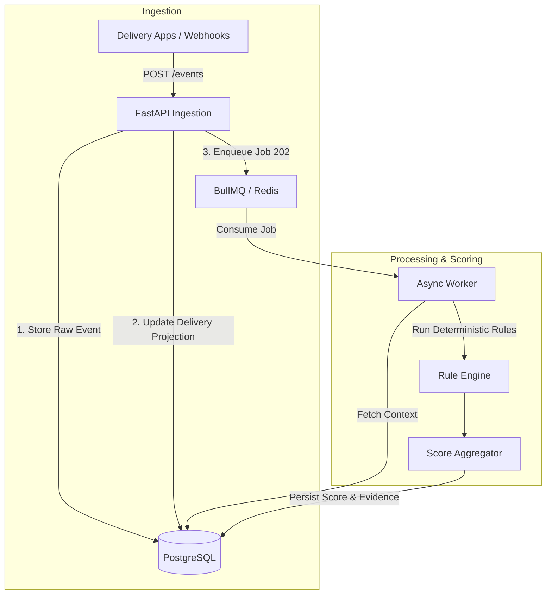

# 1. Overview & Architecture

## Problem Statement
Delivery platforms lose significant capital to fraud that is often only caught *after* the money moves. Bad actors utilize GPS spoofing apps, execute ghost deliveries (waiting out timers near the location without approaching the door), or exploit refunds by falsely claiming "did not arrive" against verified drop-offs. Individually, these signals are weak, but structurally, they follow clear mathematical and behavioral patterns.

The **Delivery Fraud Risk Engine** detects these patterns at the *decision moment* (payouts, refunds, in-flight ops) with explainable reasoning, without blocking the primary delivery flow.

## Architectural Philosophy
The core philosophy is **event-driven out-of-band evaluation**.

1. **Non-Blocking Ingestion**: The delivery application fires events (e.g., `location_ping`) via `POST /events`. The API responds instantly (`202 Accepted`) and delegates work to a queue. The core product flow is never stalled by fraud checks.
2. **Deterministic over Opaque ML**: A rule produces a score because a specific mathematical threshold was crossed. You know *why* a payout was held because the engine provides the exact distance, speed, and time equations in the evidence payload. 

## The 4-Table Context Model
Evaluating fraud requires understanding not just *what happened* (the event), but *the context of the physical world* (where the door is, who the rider is).

The database architecture relies on exactly four decoupled tables:

1. **`events` (Append-Only Facts)**:
   Immutable log of what happened. Holds `lat`, `lng`, `occurred_at`, and a flexible JSONB `payload`.
2. **`deliveries` (State Projection)**:
   The "join hub" that context-hydrates the rules. It extracts the `target_lat`, `target_lng`, `status`, and `geofence_radius_m` from events so that rules do not have to continuously rebuild the state from scratch.
3. **`scores` (Risk Assessments)**:
   Entity-scoped (attached to a `delivery`, `rider`, or `pair`) normalized integer 0-100. It snapshots the `ruleset_version` and the computed `band` (`LOW`, `ELEVATED`, `HIGH`, `CRITICAL`).
4. **`rule_executions` (Explainable Evidence)**:
   For a given score, this table contains a row for every rule that ran. It flags `fired=True/False` and contains a JSONB `evidence` blob containing the exact mathematical outputs (e.g., speed calculated).

## Infrastructure & Data Flow

By cleanly separating the raw physical event from the state projection and the final assessment, the engine can adapt to varying payloads while keeping the core rule logic entirely mathematical.
